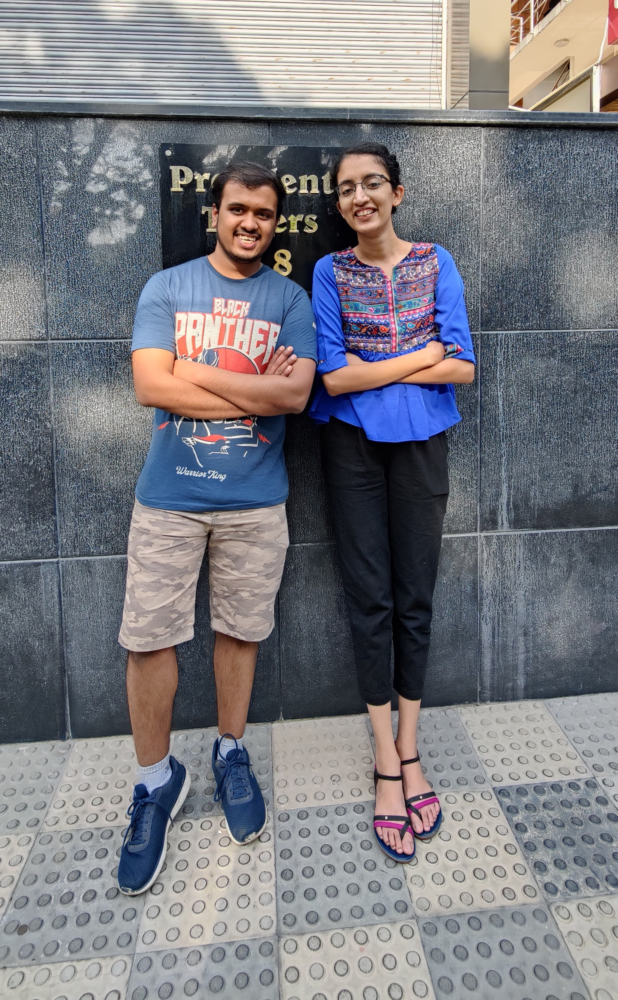

<!--_class: title-->
# Once upon a "time" ...

The story of a Hyperluminal being traveling through the
mystical multiverse.

 
 
 

&nbsp; &nbsp; &nbsp; &nbsp; &nbsp; &nbsp; &nbsp; &nbsp; &nbsp; &nbsp; &nbsp; &nbsp; &nbsp; &nbsp; &nbsp; :arrow_right: :arrow_right: :arrow_right:

---

# Chapter-1: The Origins

> A long long time ago, nothing in the world existed as we know now...

Our universe was just a mere ball of quantum excitations and energy swirling around in the nothingness of empty space...

Oh wait, there wasn't any space back then either... right :P

Space and time as we know it, were just a dream that the God **(particle)** could think of. Alas! Everything back then was just a densely packed ball of of quantum fields.

But the God **(particle)** didn't like this, and became jealous of the other universes that it could see flourishing with life and technology...

---

# That's  when the God **(particle)** summoned    **The Hyperluminal**!!

---

# Chapter-2: The travels

> Are there multiple universes?   Depends on what you believe...

As a Hyperluminal, travelling faster than light was a cup of cosmic tea for her. That is exactly what she needed to travel to other universes in this infinite multiverse.

Our reality – C-137, like every other reality, has a one and only one Hyperluminal. But during her travels, she met a lot of other hyperluminals from every reality, specifically – K-184, G-013, Y-593, T-859, and many more.

She got a chance to learn many things from their experiences and how they managed to kickstart their universe.

But everything wasn't as smooth as she expected...

---

<!--_class: image invert-->

Most of the Hyperluminals were good, but   some of them had evil intentions to eliminate   the competition. The E-589 Hyperluminal,   came up with a terrible plan to replace our   Hyperluminal and destroy our "to-be"   universe's primordial soup of quantum fields.

At that instant, she realised that to have a   place in this multiversal battle, she would   have to defeat the evil Hyperluminal and   regain control of the situation.

As she believed in maintaining peace and had no previous experience in physical combat, she decided to do this the smart way! She planned lay a trap for the evil Hyperluminal into thinking that she was attacking the "to-be" C-137, but actually she would just be attacking a simulation of the reality C-137, running on a quantum computer that one of the scientists in Q-007 built under the guidance of their Hyperluminal.

The idea was to entangle the evil Hyperluminal's soul with this quantum computer so that she spawns multiple versions of herself for each decision that she makes during the attack, and gets trapped within vast web of her own possible decision. The name of this strategy was – **Operation Infinite Probability Ring**.

---

# Chapter-3:  Infinite Probability Ring

> If it's probable, it will definitely happen.

The Infinite Probability Ring, was one of the marvels of science in the Q-007 reality. At its center, is an all powerful quantum computer which can simulate entire civilizations, space, time, and the whole history of a universe.

Around it, is a ring consisting of the possible things that could happen in that universe... **all happening at the same instant of time**, hence the name.

It used to power the initial experiments that were being done by the scientists to understand how their universe came into existence and if they could make their own baby universe.

---

<!--_class: image invert-->

The C-137 Hyperluminal then started to lay out   the plan. She charted out the course of history,   science, research and development that would   take place in C-137, and using her knowledge   from other realities, she made a quantum   program to encode the "to-be" reality of C-137   using the quantum simulator developed by   Q-007 reality's Qbeer.

The time arrived when the evil Hyperluminal   gathered her forces for an attack. She said,   "I'll destroy anyone who comes in my way to take over C-137!!"

The other Hyperluminals, although scared for their life, slyly directed her army to the fake C-137. The war started and the evil Hyperluminal almost destroyed the fake C-137. However, the quantum program was able to successfully create infinite possibilities of the her army and they started to attack their alternate versions, eventually getting trapped in their own decisions.

The evil Hyperluminal understood that all this was a setup. She took her celestial cannon and shot right at the center of the infinite probability ring leading to a huge explosion in the main quantum computer.

---

# Chapter-4:  The Simulation

> Are we in a simulation?   If you can't tell the difference, does it really matter?

KA-BOOOM!!!

"What was that?", the C-137 Hyperluminal asked Qbeer.

"The evil Hyperluminal just shot down our systems and the main quantum computer has sustained a lot of damage. We would need to evacuate and teleport the prison somewhere else, otherwise everything would be destroyed here in my universe!", said Qbeer.

"Get the quantum teleporter started, until then, I'll hold her off!", said the C-137 Hyperluminal.

---

<!--_class: image invert-->

The C-137 Hyperluminal deployed additional   force-fields around the perimeter to secure the   quantum computer from further damage and to   prevent decoherence because of the evil   Hyperluminal's attacks. The force fields were   able to hold off any major damages, but some   quantum noise was still able to penetrate   through the shields. This noise led to major   decoherence in the quantum teleporter, and   they could not get out of there in time.

 

Qbeer exclaimed, "We won't be able to teleport if the noise keeps leaking in from the evil Hyperluminal's attacks on our shield. If too much noise seeps in, the system would overheat, and the Q-007 reality will implode on itself."

"Oh no! That's terrible. Do we have any other options to ensure safety of your home reality, Qbeer?", asked the C-137 Hyperluminal.

"There is one last resort. We could entangle the fake and real C-137 so that we can open a wormhole in multiversal space instead of using quantum teleportation.", said Qbeer.

---

<!-- _class: image invert -->

"But that would endanger C-137 and an attack   would be imminent from the evil Hyperluminal.   Are you sure there isn't any other way?", asked   the C-137 Hyperluminal.

"Unfortunately, we're out of options here. The   C-137 reality is still in its infant stages with no   life, but if the quantum computer explodes here,   millions of trillions of lives would be endangered.   We need to make a decision fast!", said Qbeer.

Judging from the situation, the Hyperluminal   from C-137 and Qbeer looked at each other, and   shook their heads – "Let's do this!", they said.

The C-137 Hyperluminal entangled the fake and real C-137s using her quantum algorithm and hoped for the best. Soon enough, a wormhole opened and the evil Hyperluminal's prison – the Infinite Probability Ring, transported through the wormhole, into the multiversal space and ended up right next to the infant C-137 reality.

The stresses generated from this wormhole, were enough to distort the fabric of the multiverse by a lot, which rendered the evil Hyperluminal powerless because of her weakened connection to E-589, trapping her in a prison of her own mind, with uncountable decisions leading to infinite possibilities...

---

# Chapter-5:  The Big Bang

> It's a good time to create a new universe ;)

Once the evil Hyperluminal was captured and her prison securely placed in the multiversal fabric, far away from C-137, our Hyperluminal appointed Qbeer to maintain and look over the quantum computer and prevent it from decohering again.

From all the knowledge that the Hyperluminal gained, she held a council meeting of all the God **(particles)** and explained them how to impart mass to the quantum fields and create other particles.

The God **(particle)** came to be known as the **Higgs Boson** (I seriously don't understand why Humans gotta name stuff after themselves :man_shrugging:), and other particles as **The Standard Model**.

---

Throughout the history, our Hyperluminal has protected us against forces of pure evil and enabled formation of stars, galaxies, clusters, planets, and helped nurture life on planets like Earth, Trappist-1b, Proxima-B... Oops my bad, Humans still don't know about the last two :P

Anyway, Humans have been difficult at times with wars and capitalism, but they do recognize the efforts of our Hyperluminal. As an honor, they have given our saviour the name – **Amulya**, meaning precious or priceless, which she is in the true sense, to our universe! Even the people from my reality – Q-007, added this word to their dictionary and have recognized this name, written as:

<!--_class: morse invert-->
### •– &nbsp; –– &nbsp; ••– &nbsp; •–•• &nbsp; –•–– &nbsp; •–

Humans call it the Morse code (again, get over yourself Humans, you don't see celestials naming universes after them :man_shrugging:).

---

# Bonus Chapter:  The Black Holes

> If entangled, two entities can still influence each other when far apart.

As the evil Hyperluminal's connection to her reality got weaker, she started to get trapped more and more in the Infinite Probability Ring, which was now entangled with C-137, growing and evolving together.

Although, it is now shielded forever, the wormhole left multiple scars on the prison. It still holds the evil Hyperluminal inside and every few billion years, she tries to escape by exploiting the connection to C-137 and making new smaller wormholes, branching out from the main one.

These malicious wormholes made as an attempt to escape, are now referred to as **Black Holes**.

---

# To be continued ...

*Respear Hyperluminal **Amulya***, you started your existence this very day, and have had a lot of adventures in your time during and before our universe was ever born. You has protected us from many celestial calamities and kept the evil Hyperluminal locked away, for good. On behalf of all the Humans and quantum beings from Q-007:

<!--_class: morse invert-->
### •–– &nbsp; • &nbsp; | &nbsp; •••• &nbsp; ––– &nbsp; •––• &nbsp; • &nbsp; | &nbsp; –•–– &nbsp; ––– &nbsp; ••– &nbsp; | &nbsp; •••• &nbsp; •– &nbsp; •••– &nbsp; • &nbsp; | &nbsp; •– &nbsp; –• &nbsp; | &nbsp; •– &nbsp; –– &nbsp; •– &nbsp; ––•• &nbsp; •• &nbsp; –• &nbsp; ––• &nbsp; | &nbsp; –•–– &nbsp; • &nbsp; •– &nbsp; •–• &nbsp; | &nbsp; •– &nbsp; •••• &nbsp; • &nbsp; •– &nbsp; –•• &nbsp; –•–•––

### •••• &nbsp; •– &nbsp; •––• &nbsp; •––• &nbsp; –•–– &nbsp; | &nbsp; ••––– &nbsp; ••••• &nbsp; – &nbsp; •••• &nbsp; | &nbsp; –••• &nbsp; –•• &nbsp; •– &nbsp; –•–– &nbsp; –•–•–– &nbsp; –•–•–– &nbsp; | &nbsp; –•––• &nbsp; •• &nbsp; –• &nbsp; | &nbsp; •••• &nbsp; ••– &nbsp; –– &nbsp; •– &nbsp; –• &nbsp; | &nbsp; –•–– &nbsp; • &nbsp; •– &nbsp; •–• &nbsp; ••• &nbsp; | &nbsp; –––••• &nbsp; •––• &nbsp; –•––•–

---

<!--_class: ending invert-->
# ¡42 and 73!
